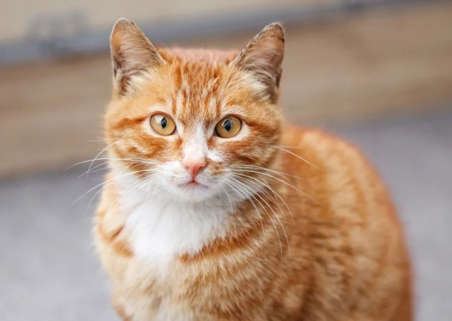

# Mit Git Projekt

Dette er mit første projekt med **Git**, **GitHub** og **Visual Studio Code**.

## Om projektet

Projektet indeholder en simpel hjemmeside lavet i HTML.

## Filer

- `index.html`
- `README.md`

## Formål

Formålet er at lære:

- Git
- GitHub
- Visual Studio Code
- Markdown
- Commits
- Push og pull
## Links

[Besøg GitHub](https://github.com/)
## Billede

## Ændring fra GitHub

Denne tekst er tilføjet direkte på GitHub for at teste git pull.
